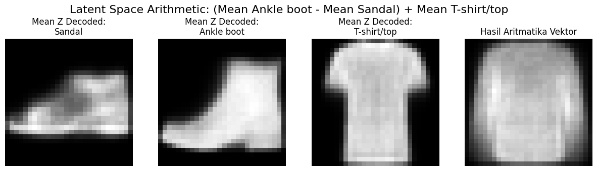
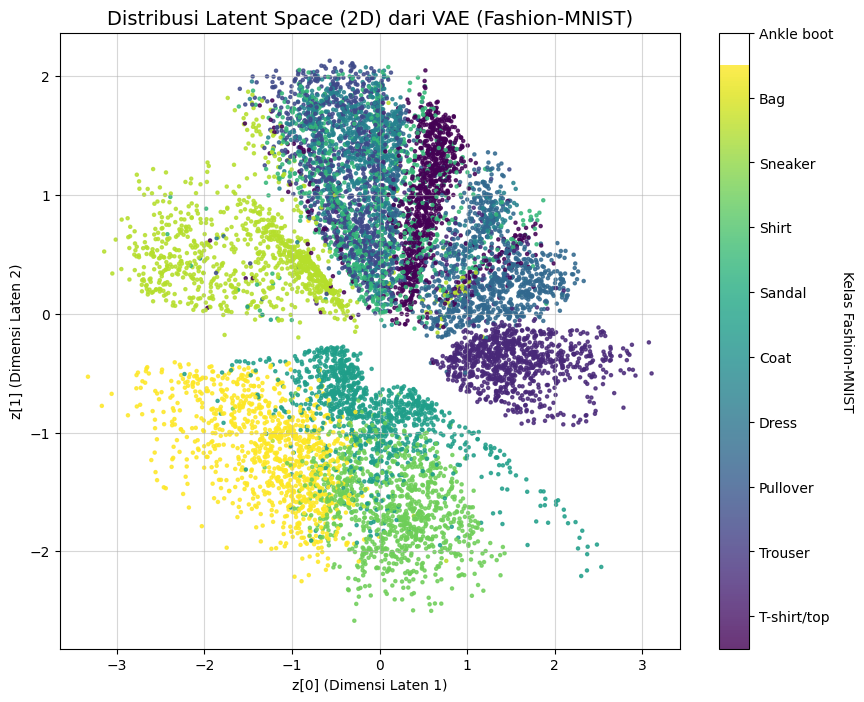

# Variational-Autoencoder-VAE-
# Variational Autoencoder (VAE) pada Dataset Fashion-MNIST

Repositori ini berisi implementasi **Variational Autoencoder (VAE)** menggunakan dataset **Fashion-MNIST**. Proyek ini bertujuan untuk memahami bagaimana VAE mempelajari representasi laten (latent space), membandingkannya dengan Autoencoder (AE) biasa, serta mengeksplorasi kemampuan latent space melalui interpolasi, visualisasi 2D, dan aritmetika vektor.

---

## Tujuan Proyek

1. Mengimplementasikan Variational Autoencoder (VAE) untuk data citra grayscale.
2. Membandingkan hasil rekonstruksi **VAE (bersifat halus/probabilistik)** dengan **Autoencoder (AE) deterministik**.
3. Menganalisis struktur latent space dalam 2 dimensi.
4. Melakukan eksplorasi latent space melalui:

   * Grid interpolasi
   * Visualisasi distribusi kelas
   * Latent space arithmetic

---

## Dataset

Dataset yang digunakan adalah **Fashion-MNIST**, terdiri dari 70.000 gambar grayscale berukuran 28x28 piksel yang terbagi ke dalam 10 kelas:

* T-shirt/top
* Trouser
* Pullover
* Dress
* Coat
* Sandal
* Shirt
* Sneaker
* Bag
* Ankle boot

Dataset ini dipilih karena kompleksitasnya lebih tinggi dibanding MNIST angka, sehingga cocok untuk mengevaluasi kemampuan model generatif.

---

## Arsitektur Model

### 1. Autoencoder (AE)

* Encoder memetakan citra input ke latent vector.
* Decoder merekonstruksi kembali citra dari latent vector.
* Bersifat deterministik.

### 2. Variational Autoencoder (VAE)

* Encoder menghasilkan **mean (μ)** dan **log-variance (log σ²)**.
* Sampling latent vector menggunakan **reparameterization trick**.
* Decoder menghasilkan rekonstruksi citra.
* Loss function terdiri dari:

  * Reconstruction Loss
  * KL Divergence

---

## Struktur File

```
├── 41236824_tugas_VAE.ipynb   # Notebook utama eksperimen VAE dan AE
├── GRID VA.png               # Visualisasi grid interpolasi latent space VAE
├── VAE VS SA.png             # Perbandingan citra asli, rekonstruksi VAE, dan AE
├── LSA.png                   # Latent Space Arithmetic (operasi vektor laten)
├── 2D.png                    # Distribusi latent space 2D dari VAE
└── README.md                 # Dokumentasi proyek
```

---

## Hasil dan Visualisasi

### 1. Grid Interpolasi Latent Space VAE (`GRID VA.png`)


Gambar ini menampilkan **grid interpolasi 2D** dari latent space VAE. Setiap titik pada grid merupakan hasil decoding vektor laten (z = (z1, z2)) yang nilainya berubah secara bertahap.

**Penjelasan:**

* Sumbu horizontal merepresentasikan dimensi laten pertama.
* Sumbu vertikal merepresentasikan dimensi laten kedua.
* Perubahan bentuk objek (tas, pakaian, sepatu) terjadi secara halus.

**Kesimpulan:**
VAE berhasil mempelajari latent space yang **kontinu dan smooth**, sehingga cocok untuk generasi data baru.

---

### 2. Perbandingan Rekonstruksi VAE dan AE (`VAE VS SA.png`)


Gambar ini memperlihatkan perbandingan hasil rekonstruksi antara **VAE** dan **Autoencoder (AE)**.

**Susunan baris gambar:**

* Baris 1: Gambar asli (input)
* Baris 2: Rekonstruksi VAE (halus/blurry)
* Baris 3: Rekonstruksi AE (lebih tajam)

**Analisis:**

* VAE menghasilkan gambar lebih halus karena adanya regularisasi distribusi laten.
* AE menghasilkan rekonstruksi lebih tajam karena bersifat deterministik.

---

### 3. Latent Space Arithmetic (`LSA.png`)



Gambar ini menunjukkan eksperimen **aritmetika pada latent space** dengan operasi:

```
(Mean Ankle boot − Mean Sandal) + Mean T-shirt/top
```

**Penjelasan:**

* Setiap kelas direpresentasikan sebagai rata-rata vektor laten.
* Operasi vektor dilakukan di latent space.
* Hasil decoding menunjukkan citra baru hasil kombinasi konsep.

**Kesimpulan:**
Latent space VAE bersifat **semantik**, di mana operasi matematika merepresentasikan perubahan makna visual.

---

### 4. Distribusi Latent Space 2D (`2D.png`)



Gambar ini memperlihatkan sebaran latent space 2D dari seluruh data Fashion-MNIST, dengan warna berbeda untuk setiap kelas.

**Penjelasan:**

* Setiap titik merepresentasikan satu data citra.
* Warna menunjukkan label kelas.
* Beberapa kelas membentuk klaster yang jelas (sepatu, tas).
* Kelas pakaian memiliki overlap karena kemiripan visual.

**Kesimpulan:**
Visualisasi ini menunjukkan bahwa VAE mampu menangkap struktur global dan hubungan antar kelas dalam ruang laten.

---

## Teknologi yang Digunakan

* Python
* TensorFlow / Keras
* NumPy
* Matplotlib
* Google Colab
